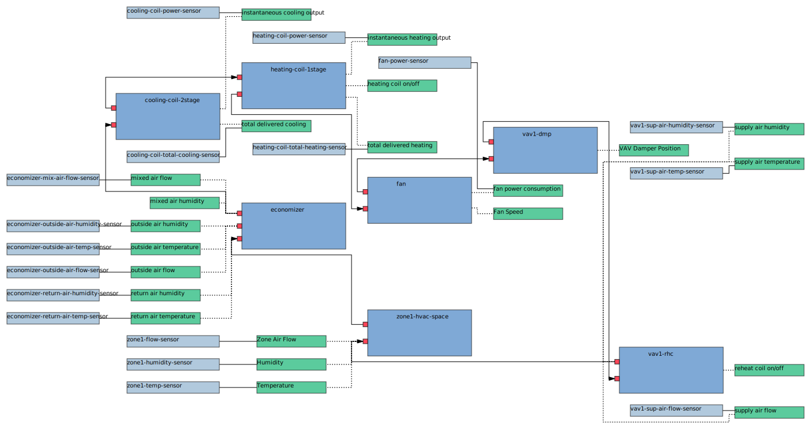

# RDF ELK

```
./build-svg.sh models/223p/doe-medium-office-ahu-vav.ttl
```

Then open `doe-medium-office-ahu-vav.ttl.svg` in a browser

## Examples

### `models/223p/doe-medium-office-ahu-vav.ttl`


